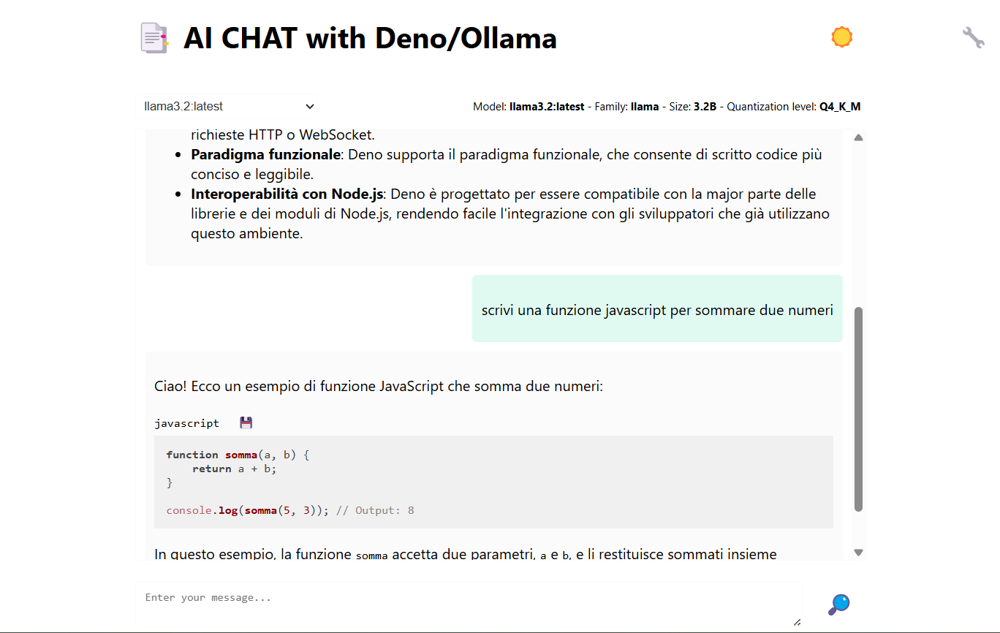

# My Deno & Ollama AI Chat


This is a simple AI chat application built with [Deno 2](https://deno.com/)
[Ollama](https://github.com/ollama/ollama), HTML, CSS and Vanilla JS.

## Running the Project

After installing Deno 2 and ollama, run the following command to start the dev server on `http://localhost:3000`:

```bash
deno task start
```

## Features

- Chat with an AI assistant called MAX (or change the system prompt in the chat preferences).
- Copy code snippets from the chat messages.
- Highlight code snippets in the chat messages.
- Use markdown in the chat messages to format markdown text.
- Light and dark themes.

## Dependencies

- [Deno](https://deno.com/)
- [highlight.js](https://highlightjs.org/)
- [marked](https://marked.js.org/)
- [DOMPurify](https://github.com/cure53/DOMPurify)

## License

This project is licensed under the MIT License.
