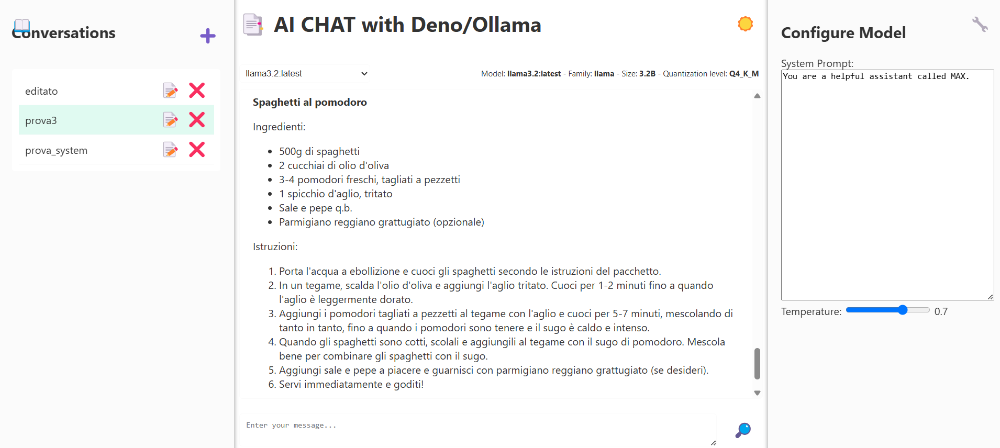

# My AI Chat with Deno 2 & Ollama



This is a basic AI chat application built with [Deno 2](https://deno.com/),
[Ollama](https://github.com/ollama/ollama), HTML, CSS and Vanilla JS.

## Running the Project

After installing Deno 2 and ollama, run the following command to start the dev
server on `http://localhost:3000`:

```bash
deno task start
```

## Features

- Chat with an AI assistant called MAX (or change the system prompt in the chat
  preferences).
- Copy code snippets from the chat messages.
- Highlight code snippets in chat messages.
- Use markdown in the chat messages to format markdown text.
- Light and dark themes.
- Manage conversations: add, edit, and delete conversations with SQLite3.
- Configure model system prompt and temperature.
- Download single chat as markdown file.

## Dependencies

- [Deno](https://deno.com/)
- [highlight.js](https://highlightjs.org/)
- [marked](https://marked.js.org/)
- [DOMPurify](https://github.com/cure53/DOMPurify)
- [SQLite3 in Deno](https://docs.deno.com/examples/http_server_oak_crud_middleware_with_sqlite3_db/)

## License

This project is licensed under the MIT License.
